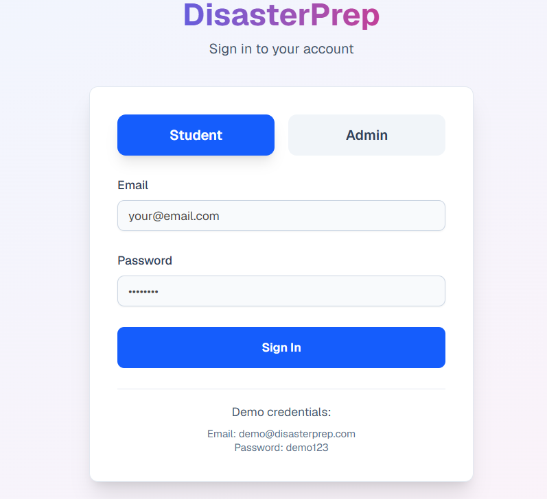
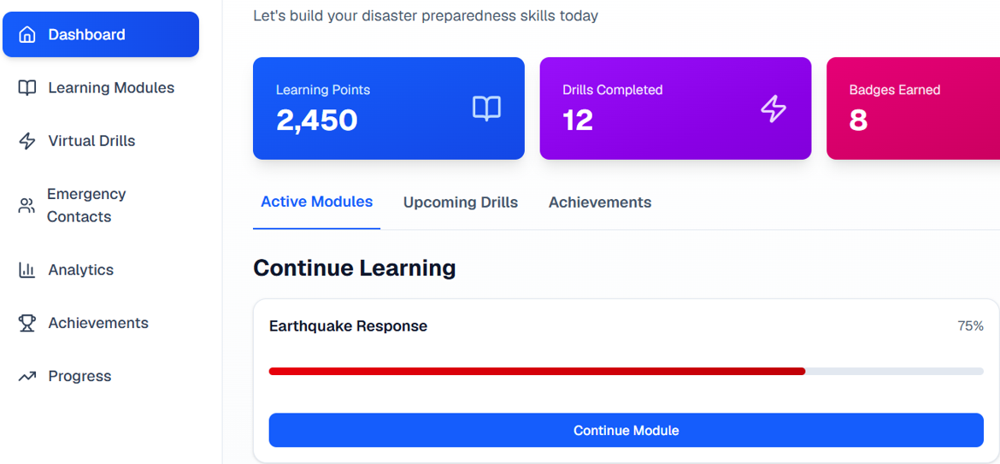
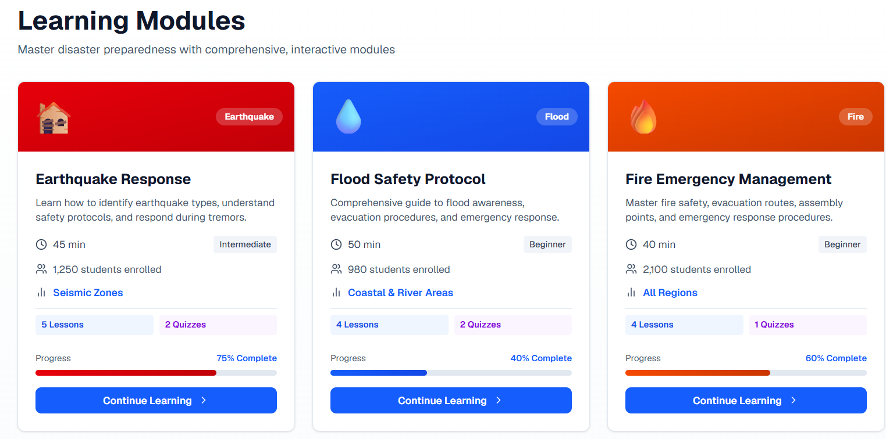
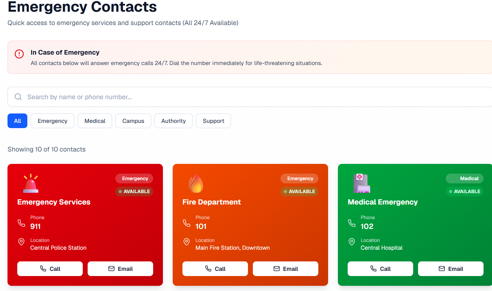
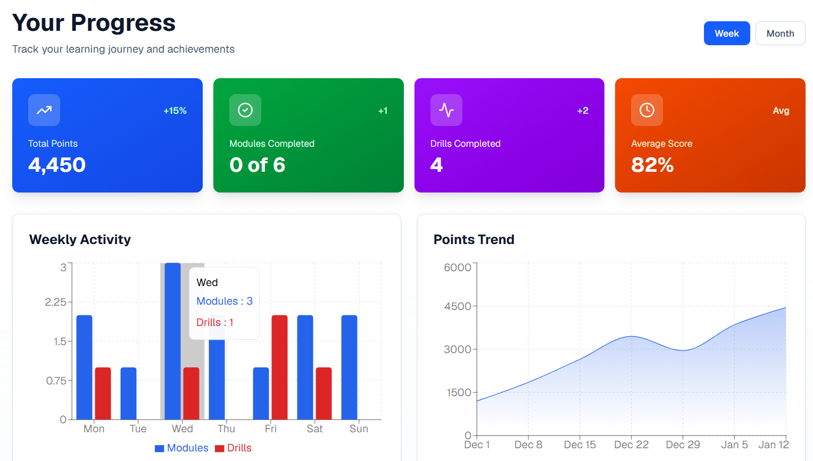

# 🌍 DisasterPrepEdu — Learn Today, Respond Tomorrow

> *Disasters don’t send invitations. Preparedness should not wait for one.*

DisasterPrepEdu is a role-based disaster preparedness education platform built to transform traditional awareness programs into **interactive, skill-oriented digital training** for schools and colleges.
Instead of depending only on occasional physical drills and theoretical sessions, the platform helps students practice emergency response through structured learning modules, quizzes, simulations, analytics, and gamified engagement.


---

## 📌 Problem We Address

In many educational institutions, disaster preparedness is often limited to:

* One-time awareness seminars
* Rare evacuation drills
* Static theoretical instructions
* Lack of continuous monitoring

This creates a gap between:
✅ *knowing what to do*
and
❌ *being able to react during a real emergency*

DisasterPrepEdu bridges this gap through:

* Continuous digital learning
* Scenario-based simulations
* Progress tracking
* Region-adaptive preparedness training

---

# ✨ Core Features

## 🎓 Structured Disaster Learning

Students can learn disaster preparedness step-by-step through interactive modules covering:

* 🌎 Earthquake Response
* 🌊 Flood Safety
* 🔥 Fire Emergency Management
* 🚨 Emergency Protocols

Each module includes:

* Lessons
* Region-specific guidance
* Progress indicators
* Quizzes
* Completion tracking

---

## ⚡ Virtual Disaster Drills

The platform replaces infrequent manual drills with:

* Timed emergency simulations
* Real-time decision making
* Practical response evaluation
* Performance scoring

Students actively practice:

* Evacuation procedures
* Emergency prioritization
* Disaster response actions

---

## 🏆 Gamified Learning Experience

To improve engagement and retention, the system includes:

* Learning Points
* Badges & Achievements
* Leaderboards
* Drill Scores
* Learning Streaks

Preparedness becomes an interactive challenge instead of passive learning.

---

## 📊 Smart Analytics Dashboard

Administrators and educators can monitor:

* Student preparedness levels
* Drill participation
* Quiz performance
* Module completion rates
* Institutional readiness

This helps institutions measure training effectiveness in real time.

---

## ☎️ Emergency Contact System

Quick-access emergency directory including:

* Police
* Fire Department
* Medical Emergency
* Campus Authorities
* Support Services

Designed for immediate accessibility during emergencies.

---

# 🖼️ Platform Preview

## 🔐 Login Interface

Simple role-based authentication system for students and administrators.



---

## 📈 Student Dashboard

Tracks preparedness growth, drill performance, badges, and learning activity.



---

## 📚 Learning Modules

Interactive disaster-specific educational modules.



---

## ☎️ Emergency Contacts

Categorized emergency support system with quick access.



---

## 📊 Progress Analytics

Visual reports showing weekly activity and preparedness trends.



---

# 🏗️ System Architecture

The platform follows a layered architecture:

```text
┌─────────────────────────────┐
│      Presentation Layer     │
│  Student & Admin Interfaces │
└──────────────┬──────────────┘
               │
┌──────────────▼──────────────┐
│      Application Layer      │
│ Authentication              │
│ Learning Engine             │
│ Quiz Evaluation             │
│ Virtual Drill Engine        │
│ Analytics & Gamification    │
└──────────────┬──────────────┘
               │
┌──────────────▼──────────────┐
│         Data Layer          │
│ Users • Scores • Progress   │
│ Drill Results • Analytics   │
└─────────────────────────────┘
```

---

# 🔄 Workflow

```text
User Login
    │
    ▼
Role Verification
    │
 ┌──┴─────────────┐
 ▼                ▼
Student         Admin
 │                │
 ▼                ▼
Modules       Analytics
 │                │
 ▼                ▼
Quizzes      Monitoring
 │
 ▼
Virtual Drills
 │
 ▼
Scores + Badges
```

---

# 🛠️ Tech Stack

| Technology                  | Purpose                       |
| --------------------------- | ----------------------------- |
| React.js                    | Frontend UI                   |
| Tailwind CSS                | Styling & Responsive Design   |
| JavaScript                  | Application Logic             |
| Firebase / Backend Services | Authentication & Data Storage |
| Chart Libraries             | Analytics Visualization       |
| Role-Based Access Control   | Secure User Management        |

---

# 📂 Project Structure

```bash
Disaster-Prep-Edu/
│
├── public/
│   ├── ss1.png
│   ├── ss2.png
│   ├── ss3.png
│   ├── ss4.png
│   └── ss5.png
│
├── src/
│   ├── components/
│   │   ├── dashboard/
│   │   ├── modules/
│   │   ├── drills/
│   │   ├── analytics/
│   │   └── emergency/
│   │
│   ├── pages/
│   │   ├── Login.jsx
│   │   ├── Dashboard.jsx
│   │   ├── LearningModules.jsx
│   │   ├── EmergencyContacts.jsx
│   │   └── Progress.jsx
│   │
│   ├── assets/
│   ├── services/
│   ├── context/
│   ├── utils/
│   └── App.jsx
│
├── package.json
├── tailwind.config.js
└── README.md
```

---

# 🚀 Getting Started

## 1️⃣ Clone the Repository

```bash
git clone https://github.com/Nidhi-hb/Disaster-Prep-Edu.git
```

---

## 2️⃣ Navigate to Project Directory

```bash
cd Disaster-Prep-Edu
```

---

## 3️⃣ Install Dependencies

```bash
npm install
```

---

## 4️⃣ Start Development Server

```bash
npm run dev
```

---

# 🎯 Key Objectives

✅ Improve disaster response awareness
✅ Provide continuous preparedness training
✅ Replace infrequent physical drills with digital practice
✅ Increase engagement using gamification
✅ Enable institutional monitoring and analytics
✅ Support scalable deployment across educational institutions

---

# 📊 Experimental Outcomes

Internal validation of the platform indicated:

* 📚 85% module completion rate
* 🧠 78% quiz scores above 80%
* ⚡ Disaster drill accuracy improved from 54% → 82%
* 🏆 65% increase in learner engagement
* 📉 40% reduction in training dropouts

---

# 🔮 Future Enhancements

* 📱 Mobile Application Support
* 🌐 Multilingual Learning Modules
* 📡 Real-Time Disaster Alerts
* 📍 Geo-location Based Risk Adaptation
* 📴 Offline Learning Access
* 🤖 AI-driven Adaptive Simulations

---


**DisasterPrepEdu** focuses on turning awareness into action through continuous learning, virtual practice, and measurable preparedness training.


